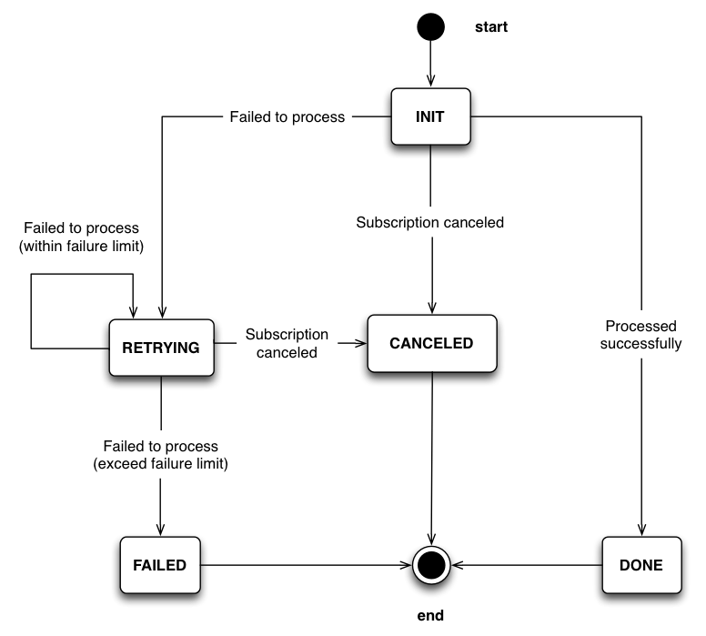

REST API reference
==================

The official endpoint of Billy API is

::

    https://billing.balancedpayments.com

By the time I am writing this, it is not deployed yet. And once it is deployed,
it will be in **beta** stage for a while. Be ready to encounter some bugs if you 
are going to use it. When you find a bug, or you have any suggestion to this
project, please create an issue in our `GitHub repo`_.

.. _`GitHub repo`: https://github.com/balanced/billy

All HTTP response except errors will be in JSON format. Other format is not 
supported. To access the API, you need an API key, except the one for registering
a company. The API key should be passed as the username for HTTP basic 
authentication, leave the password blank.

Company
-------

A company is an account for the Billy system, you need to pass your Balanced
API key, so that Billy can process payments via Balanced for you. It has a 
generated API key which is required for any further calls to other methods. 

.. note::

    You **MUST** keep these API keys as **secret**, do not share them with 
    anyone, do not post them on IRC. Also, currently, Billy API key cannot be 
    retrived or reset easily, if you lost it, you can only contact 
    administrator to ask them reset it for you.

Create
~~~~~~

Create a company and return the record. Only this method does not require an
API key to access as you need it to generate one. Remember to save the API key
in response.

Method
    POST
Endpoint
    /v1/companies
Parameters
    - **processor_key** - The API key for your Balanced account

Example:

::

    curl https://billing.balancedpayments.com/v1/companies \
        -d "processor_key=ef13dce2093b11e388de026ba7d31e6f"

Response:

::

    {
        "guid": "CPMM8C8Uhkt4pDeJ8oqJu8Nj", 
        "api_key": "6w9KwCPCmCQJpEYgCCtjaPmbLNQSavv5sX4mCZ9Sf6pb", 
        "created_at": "2013-10-02T05:29:43.953987", 
        "updated_at": "2013-10-02T05:29:43.953987"
    }

Retrive
~~~~~~~

Retrive a company record

Method
    GET
Endpoint
    /v1/companies/<Company GUID>

Example:

::

    curl https://billing.balancedpayments.com/v1/companies/CPMM8C8Uhkt4pDeJ8oqJu8Nj \
        -u 6w9KwCPCmCQJpEYgCCtjaPmbLNQSavv5sX4mCZ9Sf6pb:

Response:

::

    {
        "guid": "CPMM8C8Uhkt4pDeJ8oqJu8Nj", 
        "api_key": "6w9KwCPCmCQJpEYgCCtjaPmbLNQSavv5sX4mCZ9Sf6pb", 
        "created_at": "2013-10-02T05:29:43.953987", 
        "updated_at": "2013-10-02T05:29:43.953987"
    }

Plan
----

A plan is a setup for recurring payment processing, it has the amount to 
charge or payout and the frequency of transaction.

Create
~~~~~~

Create a plan and return the record.

Method
    POST
Endpoint
    /v1/plans
Parameters
    - **plan_type** - The type of this plan, can be either **charge** for 
      charging customer or **payout** for paying out.
    - **frequency** - The frequency to schedule charging or paying out to 
      customer. Can be either

        - daily
        - weekly
        - monthly
        - yearly

      When it is **monthly** and the schedule started at end of a month, the 
      closest day to the started one in a month will be selected for following 
      transactions. For example, the started date time is 2013-01-30, then 
      following transactions will occur at 2013-02-28, 2013-03-30 and so on.
    - **amount** - The amount in USD cents to charge or payout to customer
    - **interval** - (optional) The interval of frequency period to multiply, 
      the default value is 1. For example, to charge or payout a customer
      by two weeks frequency, you can set the frequency to **weekly**, and set
      the **interval** to 2, then the schedule will be in a biweekly manner.

Example:

::

    curl https://billing.balancedpayments.com/v1/plans \
        -u 6w9KwCPCmCQJpEYgCCtjaPmbLNQSavv5sX4mCZ9Sf6pb: \
        -d "plan_type=charge" \
        -d "amount=500" \
        -d "frequency=monthly"

Response:

::

    {
        "guid": "PL97ZvyeA4wzM3WUyEG8xwps",
        "company_guid": "CPMM8C8Uhkt4pDeJ8oqJu8Nj", 
        "plan_type": "charge", 
        "interval": 1, 
        "amount": 500, 
        "frequency": "monthly", 
        "deleted": false, 
        "created_at": "2013-10-02T05:48:26.210843", 
        "updated_at": "2013-10-02T05:48:26.210843"
    }

Retrive
~~~~~~~

Retrive a plan record

Method
    GET
Endpoint
    /v1/plans/<Plan GUID>

Example:

::

    curl https://billing.balancedpayments.com/v1/plans/PL97ZvyeA4wzM3WUyEG8xwps \
        -u 6w9KwCPCmCQJpEYgCCtjaPmbLNQSavv5sX4mCZ9Sf6pb:

Response:

::

    {
        "guid": "PL97ZvyeA4wzM3WUyEG8xwps",
        "company_guid": "CPMM8C8Uhkt4pDeJ8oqJu8Nj", 
        "plan_type": "charge", 
        "interval": 1, 
        "amount": 500, 
        "frequency": "monthly", 
        "deleted": false, 
        "created_at": "2013-10-02T05:48:26.210843", 
        "updated_at": "2013-10-02T05:48:26.210843"
    }

Delete
~~~~~~

Delete a plan and return record.

Method
    DELETE
Endpoint
    /v1/plans/<Plan GUID>

Example:

::

    curl https://billing.balancedpayments.com/v1/plans/PL97ZvyeA4wzM3WUyEG8xwps \
        -X DELETE \
        -u 6w9KwCPCmCQJpEYgCCtjaPmbLNQSavv5sX4mCZ9Sf6pb:

Response:

::

    {
        "guid": "PL97ZvyeA4wzM3WUyEG8xwps",
        "company_guid": "CPMM8C8Uhkt4pDeJ8oqJu8Nj", 
        "plan_type": "charge", 
        "interval": 1, 
        "amount": 500, 
        "frequency": "monthly", 
        "deleted": true, 
        "created_at": "2013-10-02T05:48:26.210843", 
        "updated_at": "2013-10-02T05:48:26.210843"
    }

List
~~~~

List all plans of your company

Method
    GET
Endpoint
    /v1/plans
Parameters
    - **offset** - Offset for pagination, default value is 0
    - **limit** - Limit for pagination, default value is 20

Example:

::

    curl https://billing.balancedpayments.com/v1/plans \
        -u 6w9KwCPCmCQJpEYgCCtjaPmbLNQSavv5sX4mCZ9Sf6pb:

Response:

::

    {
        "items": [
            {
                "guid": "PL97ZvyeA4wzM3WUyEG8xwps",
                "company_guid": "CPMM8C8Uhkt4pDeJ8oqJu8Nj", 
                "plan_type": "charge", 
                "interval": 1, 
                "amount": 500, 
                "frequency": "monthly", 
                "deleted": false, 
                "created_at": "2013-10-02T05:48:26.210843", 
                "updated_at": "2013-10-02T05:48:26.210843"
            }
        ], 
        "limit": 20, 
        "offset": 0
    }

Customer
--------

A customer is an record for customer to your service. Before charging or paying 
out is performed to a customer, a corresponding `customer record in Balanced`_
system will be created. If you want to map an existing customer in Balanced,
you can set the external ID to the URI of customer in balanced.

.. _`customer record in Balanced`: https://docs.balancedpayments.com/current/api.html?language=bash#customers

Create
~~~~~~

Create a customer and return the record. 

Method
    POST
Endpoint
    /v1/customers
Parameters
    - **external_id** - (optional) The URI to an existing customer record in
      Balanced server

Example:

::

   curl https://billing.balancedpayments.com/v1/customers \
       -X POST \
       -u 6w9KwCPCmCQJpEYgCCtjaPmbLNQSavv5sX4mCZ9Sf6pb: 

Response:

::

    {
        "guid": "CUR1omRKGYYhqNaK1SyZqSbZ", 
        "company_guid": "CPMM8C8Uhkt4pDeJ8oqJu8Nj", 
        "external_id": null, 
        "deleted": false, 
        "created_at": "2013-10-02T06:06:21.239505", 
        "updated_at": "2013-10-02T06:06:21.239505"
    }

Retrive
~~~~~~~

Retrive a customer record

Method
    GET
Endpoint
    /v1/customers/<Customer GUID>

Example:

::

    curl https://billing.balancedpayments.com/v1/customers/CUR1omRKGYYhqNaK1SyZqSbZ \
        -u 6w9KwCPCmCQJpEYgCCtjaPmbLNQSavv5sX4mCZ9Sf6pb:

Response:

::

    {
        "guid": "CUR1omRKGYYhqNaK1SyZqSbZ", 
        "company_guid": "CPMM8C8Uhkt4pDeJ8oqJu8Nj", 
        "external_id": null, 
        "deleted": false, 
        "created_at": "2013-10-02T06:06:21.239505", 
        "updated_at": "2013-10-02T06:06:21.239505"
    }

Delete
~~~~~~

Delete a customer and return record.

Method
    DELETE
Endpoint
    /v1/customers/<Customer GUID>

Example:

::

    curl https://billing.balancedpayments.com/v1/customers/CUR1omRKGYYhqNaK1SyZqSbZ \
        -X DELETE \
        -u 6w9KwCPCmCQJpEYgCCtjaPmbLNQSavv5sX4mCZ9Sf6pb:

Response:

::

    {
        "guid": "CUR1omRKGYYhqNaK1SyZqSbZ", 
        "company_guid": "CPMM8C8Uhkt4pDeJ8oqJu8Nj", 
        "external_id": null, 
        "deleted": true, 
        "created_at": "2013-10-02T06:06:21.239505", 
        "updated_at": "2013-10-02T06:06:21.239505"
    }

List
~~~~

List all customers of your company

Method
    GET
Endpoint
    /v1/customers
Parameters
    - **offset** - Offset for pagination, default value is 0
    - **limit** - Limit for pagination, default value is 20

Example:

::

    curl https://billing.balancedpayments.com/v1/customers \
        -u 6w9KwCPCmCQJpEYgCCtjaPmbLNQSavv5sX4mCZ9Sf6pb:

Response:

::

    {
        "items": [
            {
                "guid": "CUR1omRKGYYhqNaK1SyZqSbZ", 
                "company_guid": "CPMM8C8Uhkt4pDeJ8oqJu8Nj", 
                "external_id": null, 
                "deleted": false, 
                "created_at": "2013-10-02T06:06:21.239505", 
                "updated_at": "2013-10-02T06:06:21.239505"
            }
        ], 
        "limit": 20, 
        "offset": 0
    }

Subscription
------------

To subscribe a customer to a plan, you can create a subscription record. 

Create
~~~~~~

Create a subscription and return the record. If the **funding_instrument_uri** is given,
it will be used to charge or payout to customer, however, if it is omitted,
the default payment method for that customer in Balanced will be used (The
latest added one will be used). If **started_at** is given, the subscription
will be scheduled at that date time, otherwise, current time will be
the started time, also, a transaction will be filed an processed immediately.

Method
    POST
Endpoint
    /v1/subscriptions
Parameters
    - **plan_guid** - The GUID of plan to subscribe 
    - **customer_guid** - The GUID of customer to subscribe
    - **funding_instrument_uri** - (optional) The URI to funding source in Balanced, 
      could be a tokenlized credit card or bank account URI
    - **amount** - (optional) The amount in USD cents of this subscription for 
      overwriting the one from plan, useful for giving a discount to customer
    - **started_at** - (optional) The date time of this subscription to started
      at, should be in ISO 8601 format.

Example:

::

    curl https://billing.balancedpayments.com/v1/subscriptions \
        -u 6w9KwCPCmCQJpEYgCCtjaPmbLNQSavv5sX4mCZ9Sf6pb: \
        -d "customer_guid=CUR1omRKGYYhqNaK1SyZqSbZ" \
        -d "plan_guid=PL97ZvyeA4wzM3WUyEG8xwps" \
        -d "funding_instrument_uri=/v1/marketplaces/TEST-MP7hkE8rvpbtYu2dlO1jU2wg/cards/CC1dEUPMmL1ljk4hWqeJxGno"

Response:

::

    {
        "guid": "SUR6jKqqSyaFfGeeAsGaXFqZ",
        "plan_guid": "PL97ZvyeA4wzM3WUyEG8xwps", 
        "customer_guid": "CUR1omRKGYYhqNaK1SyZqSbZ", 
        "funding_instrument_uri": "/v1/marketplaces/TEST-MP7hkE8rvpbtYu2dlO1jU2wg/cards/CC1dEUPMmL1ljk4hWqeJxGno", 
        "period": 1, 
        "amount": null, 
        "canceled": false, 
        "canceled_at": null, 
        "started_at": "2013-10-02T06:35:00.380234", 
        "next_invoice_at": "2013-11-02T06:35:00.380234", 
        "created_at": "2013-10-02T06:35:00.380234", 
        "updated_at": "2013-10-02T06:35:00.380234", 
    }

Retrive
~~~~~~~

Retrive a subscription record

Method
    GET
Endpoint
    /v1/subscriptions/<Subscription GUID>

Example:

::

    curl https://billing.balancedpayments.com/v1/subscriptions/SUR6jKqqSyaFfGeeAsGaXFqZ \
        -u 6w9KwCPCmCQJpEYgCCtjaPmbLNQSavv5sX4mCZ9Sf6pb:

Response:

::

    {
        "guid": "SUR6jKqqSyaFfGeeAsGaXFqZ",
        "plan_guid": "PL97ZvyeA4wzM3WUyEG8xwps", 
        "customer_guid": "CUR1omRKGYYhqNaK1SyZqSbZ", 
        "funding_instrument_uri": "/v1/marketplaces/TEST-MP7hkE8rvpbtYu2dlO1jU2wg/cards/CC1dEUPMmL1ljk4hWqeJxGno", 
        "period": 1, 
        "amount": null, 
        "canceled": false, 
        "canceled_at": null, 
        "started_at": "2013-10-02T06:35:00.380234", 
        "next_invoice_at": "2013-11-02T06:35:00.380234", 
        "created_at": "2013-10-02T06:35:00.380234", 
        "updated_at": "2013-10-02T06:35:00.380234", 
    }

Cancel
~~~~~~

Cancel the subscription.

Method
    POST
Endpoint
    /v1/subscriptions/<Subscription GUID>/cancel
Parameters
    - **prorated_refund** - (optional) Set 1 to issue a prorated refund for the 
      latest transaction
    - **refund_amount** - (optional) Issue a refund with specific amount for
      the latest transaction, you cannot set **prorated_refund** to true and 
      **refund_amount** in the same time

Example:

::

    curl https://billing.balancedpayments.com/v1/subscriptions/SUR6jKqqSyaFfGeeAsGaXFqZ/cancel \
        -X POST
        -u 6w9KwCPCmCQJpEYgCCtjaPmbLNQSavv5sX4mCZ9Sf6pb:

Response:

::

    {
        "guid": "SUR6jKqqSyaFfGeeAsGaXFqZ",
        "plan_guid": "PL97ZvyeA4wzM3WUyEG8xwps", 
        "customer_guid": "CUR1omRKGYYhqNaK1SyZqSbZ", 
        "funding_instrument_uri": "/v1/marketplaces/TEST-MP7hkE8rvpbtYu2dlO1jU2wg/cards/CC1dEUPMmL1ljk4hWqeJxGno", 
        "period": 1, 
        "amount": null, 
        "canceled": true, 
        "canceled_at": "2013-10-03T12:16:00.532295", 
        "started_at": "2013-10-02T06:35:00.380234", 
        "next_invoice_at": "2013-11-02T06:35:00.380234", 
        "created_at": "2013-10-02T06:35:00.380234", 
        "updated_at": "2013-10-02T06:35:00.380234", 
    }

List
~~~~

List all subscriptions of your company

Method
    GET
Endpoint
    /v1/subscriptions
Parameters
    - **offset** - Offset for pagination, default value is 0
    - **limit** - Limit for pagination, default value is 20

Example:

::

    curl https://billing.balancedpayments.com/v1/subscriptions \
        -u 6w9KwCPCmCQJpEYgCCtjaPmbLNQSavv5sX4mCZ9Sf6pb:

Response:

::

    {
        "items": [
            {
                "guid": "SUR6jKqqSyaFfGeeAsGaXFqZ",
                "plan_guid": "PL97ZvyeA4wzM3WUyEG8xwps", 
                "customer_guid": "CUR1omRKGYYhqNaK1SyZqSbZ", 
                "funding_instrument_uri": "/v1/marketplaces/TEST-MP7hkE8rvpbtYu2dlO1jU2wg/cards/CC1dEUPMmL1ljk4hWqeJxGno", 
                "period": 1, 
                "amount": null, 
                "canceled": false, 
                "canceled_at": null, 
                "started_at": "2013-10-02T06:35:00.380234", 
                "next_invoice_at": "2013-11-02T06:35:00.380234", 
                "created_at": "2013-10-02T06:35:00.380234", 
                "updated_at": "2013-10-02T06:35:00.380234", 
            }
        ], 
        "limit": 20, 
        "offset": 0
    }

Transaction
-----------

Transactions are records generated from subscriptions. It contains the current
status, type of transaction, amount, funding instrument URI, failure count and 
error message. The life cycle of a transaction is shown in following state 
transition diagram

For all status:

 - **INIT** - just created transaction
 - **RETRYING** - attempt to process but failed, retrying
 - **CANCELED** - the subscription is canceled before the transaction is done 
   or failed
 - **FAILED** - the transaction failure count exceeded limitation
 - **DONE** - the transaction is processed successfully

Retrive
~~~~~~~

Retrive a transaction record

Method
    GET
Endpoint
    /v1/transactions/<Transaction GUID>

Example:

::

    curl https://billing.balancedpayments.com/v1/transactions/TXWRvbzADhsBHFhgkVMWB3Lb \
        -u 6w9KwCPCmCQJpEYgCCtjaPmbLNQSavv5sX4mCZ9Sf6pb:

Response:

::

    {
        "guid": "TXWRvbzADhsBHFhgkVMWB3Lb", 
        "subscription_guid": "SUWRtr1b8s5tejhEPejybvwR", 
        "status": "done", 
        "transaction_type": "charge", 
        "amount": 500, 
        "funding_instrument_uri": "/v1/marketplaces/TEST-MP7hkE8rvpbtYu2dlO1jU2wg/cards/CC5ildoSnySGnXRfrYvH49eo", 
        "external_id": "/v1/marketplaces/TEST-MP7hkE8rvpbtYu2dlO1jU2wg/debits/WD5P9jvc7fLSoA6gYXxHkPd4", 
        "failure_count": 0, 
        "error_message": null, 
        "scheduled_at": "2013-10-03T05:09:07.702489",
        "created_at": "2013-10-03T05:09:07.709617", 
        "updated_at": "2013-10-03T05:09:10.837832"
    }

List
~~~~

List all transactions of your company

Method
    GET
Endpoint
    /v1/transactions
Parameters
    - **offset** - Offset for pagination, default value is 0
    - **limit** - Limit for pagination, default value is 20

Example:

::

    curl https://billing.balancedpayments.com/v1/transactions \
        -u 6w9KwCPCmCQJpEYgCCtjaPmbLNQSavv5sX4mCZ9Sf6pb:

Response:

::

    {
        "items": [
            {
                "guid": "TXWRvbzADhsBHFhgkVMWB3Lb", 
                "subscription_guid": "SUWRtr1b8s5tejhEPejybvwR", 
                "status": "done", 
                "transaction_type": "charge", 
                "amount": 500, 
                "funding_instrument_uri": "/v1/marketplaces/TEST-MP7hkE8rvpbtYu2dlO1jU2wg/cards/CC5ildoSnySGnXRfrYvH49eo", 
                "external_id": "/v1/marketplaces/TEST-MP7hkE8rvpbtYu2dlO1jU2wg/debits/WD5P9jvc7fLSoA6gYXxHkPd4", 
                "failure_count": 0, 
                "error_message": null, 
                "scheduled_at": "2013-10-03T05:09:07.702489",
                "created_at": "2013-10-03T05:09:07.709617", 
                "updated_at": "2013-10-03T05:09:10.837832"
            }
        ], 
        "limit": 20, 
        "offset": 0
    }
